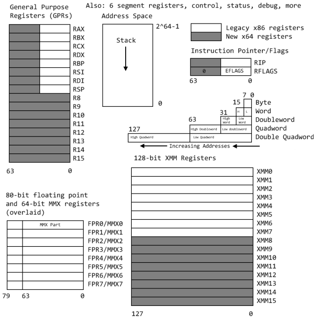
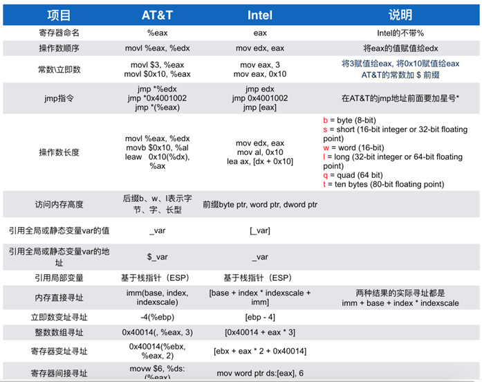
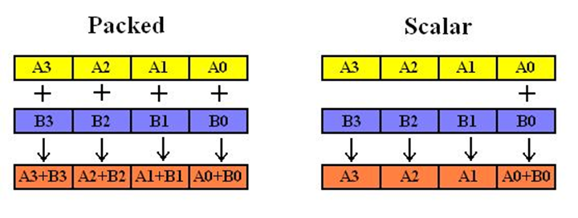

# CPUCode
此仓库是本人在秋招准备过程中关于 `CPU SIMD` 编程技巧的总结

## x64 架构下的寄存器模型
在一个现有的平台学习使用汇编的时候，要首先熟悉其寄存器组


`x86` 的汇编语言格式通常有两种, 一种是 `Intel`, 一种是 `AT&T`。单个文件生成汇编代码, `gcc -fomit-frame-pointer -fverbose-asm -S main.cpp -o main.asm`。


## 常见的优化手法
* CPU 端的优化手段, 就是尽可能地让指令都是矢量化指令(也就是让运算都是矢量化的运算)。单个指令处理多个数据的技术称为 `SIMD`, 可以大大增加计算密集型程序的吞吐量。通常认为利用同时处理 4 个 `float` 的 `SIMD` 指令可以加速 4 
```C++
float func(float a, float b){
    return a+b;
}

// 对应的汇编语言为
func(float, float):
    addss   xmm0, xmm1
    ret
```
* 其中 `xmm` 寄存器有 128 位宽, 可以容纳 4 个 `float` 或者 2 个 `double`。上面的代码中只用到了 `xmm` 的低 32 位用于存储 1 个 `float`。其中的 `addss` 可以拆分成 `add` `s` `s`。`add` 表示执行加法操作。 第一个 `s` 表示标量(scalar), 即只对应 `xmm` 的最低位进行运算, 也可以是 `p` 表示矢量(packed), 一次对 `xmm` 的所有位进行运算。第二个 `s` 表示单精度浮点数(single), 即 `float`, 也可以是 `d` 表示双精度浮点数(double)。所以 `addss` 一个 `float` 加法。`addsd` 一个 `double` 加法。`addps` 四个 `float` 加法。`addpd` 两个 `double` 加法。



### 多利用 `constexpr` 强迫编译器在编译期求值
* 编译器能够自动完成许多优化, 代数化简, 常量折叠
```C++
// 编译器进行代数化简, 编译时优化
int func(int a, int b){
    int c = a+b;
    int d = a-b;
    return (c+d)/2;
}

func(int, int):
    mov     eax, edi
    ret

// 编译器进行常量折叠, 编译时优化
int func(int a, int b){
    int ret = 0;
    for(int i=1; i<=100; i++){
        ret += i;
    }
    return ret;
}

func(int, int):
    mov     eax, 5050
    ret
```
* 但是有问题是对于存储在`堆`上的, 是不利于优化的。存储在`栈`上的, 是利于优化的。存储在 `堆` 上的有: `vector`, `map`, `set`, `string`, `unique_ptr`, `shared_ptr`, `weak_ptr`。存储在`栈`上的有: `array`, `tuple`, `pair`, `optional`, `string_view`。
* 对于 `栈` 上的复杂的代码, 编译器会放弃优化, 但是我们可以使用 `constexpr` 强迫其进行编译时优化。但是 `constexpr` 函数中使用非 `constexpr` 的容器(`vector`, `map`, `set`, `string`, ...), 函数会转变为普通的函数。
```C++
// 利用 constexpr 强迫其进行编译时优化
#include<array>

template <int N>
constexpr int func_impl() {
    std::array<int, N> arr{};
    for (int i = 1; i <= N; i++) {
        arr[i - 1] = i;
    }
    int ret = 0;
    for (int i = 1; i <= N; i++) {
        ret += arr[i - 1];
    }
    return ret;
}

int func() {
    constexpr int ret = func_impl<50000>();
    return ret;
}

func():
    push    rbp
    mov     rbp, rsp
    mov     DWORD PTR [rbp-4], 1250025000
    mov     eax, 1250025000
    pop     rbp
    ret
```
* `const` 并未区分出编译时常量和运行时常量, `constexpr` 限定在编译期常量。`constexpr` 可以修饰变量和函数。`constexpr` 修饰的函数, 如果其传入的参数可以在编译时期计算出来, 这个函数就会产生编译时期的值。如果不能的话, `constexpr` 修饰的函数就和普通函数一样。现如今, `const` 表示运行时不能被修改的常量。`constexpr` 修饰变量的时候, 要求其初始化的值必须是在编译期可确定的。
```C++
const int a = 5;  // 运行时确定的常量
constexpr int b = 10;  // 编译期确定的常量表达式
```

### 利用内联优化
* 定义在同一个文件的函数才可以被内联, 定义在不同文件中, 编译器看不见函数体里的内容, 没有办法进行内联。
```C++
// other 定义在其他的文件中, 这里只是声明, 其函数体是空的。但是我们可以从汇编代码看到, 编译器并没有实现内联。
int other(int a);

int func(){
    for(int i=0; i<100; ++i){
        other(22);
    }
}

func():
    sub     rsp, 8
.L2:
    mov     edi, 22
    call    other(int)
    jmp     .L2
```
* 所以我们为了效率尽量把 `常用函数的定义` 放在头文件中, 声明为 `static` 或者 `inline`, 这样调用他们的时候编译器磁能看到他们的函数体, 从而有机会内联。内不内联只取决于`同文件且函数体足够小`, 与是否加 `inline` 没有关系。

### 利用 __restrict 关键字
* `__restrict` 是 C99 的标准关键字, 但并不是 C++ 的关键字, 但是绝大多数主流编译器都支持。它用于向编译器指示指针所指向的对象具有特定的访问限制，即被标记为 `__restrict` 的指针是 `该对象的唯一访问途径`。
```C++
// 为什么会生成这么复杂的汇编代码, 是因为编译器不确定这些指针是否有重叠。
// 在 a, b, c 指向均无重叠的时候, c 指向的值与 b 的值相同 (第一句就可以省略的)。
// 在 b=c, 但与 a 无重叠的时候, c 指向的值为 a (第一句就不可以优化掉)。
// 所以我们可以使用 __restrict 来限制非 const 修饰的指针, 来告诉编译器具有写入权限的指针是独享其资源的。
void func(const int *a, const int *b, int*c){
    *c = *a;
    *c = *b;
}

func(int const*, int const*, int*):
        push    rbp
        mov     rbp, rsp
        mov     QWORD PTR [rbp-8], rdi
        mov     QWORD PTR [rbp-16], rsi
        mov     QWORD PTR [rbp-24], rdx
        mov     rax, QWORD PTR [rbp-8]
        mov     edx, DWORD PTR [rax]
        mov     rax, QWORD PTR [rbp-24]
        mov     DWORD PTR [rax], edx
        mov     rax, QWORD PTR [rbp-16]
        mov     edx, DWORD PTR [rax]
        mov     rax, QWORD PTR [rbp-24]
        mov     DWORD PTR [rax], edx
        nop
        pop     rbp
        ret

void func(const int * a, const int * b, int* __restrict c){
    *c = *a;
    *c = *b;
}

func(int const*, int const*, int*):
    mov     eax, DWORD PTR [rsi]
    mov     DWORD PTR [rdx], eax
    ret
```
* 所有 `非 const` 的指针都声明 `__restrict`。
* 对于 `std::vector` 也有指针别名的问题, 但是不能使用 `__restrict` 来解决。但是我们可以通过 `#pragma GCC ivdep` 预处理指令来处理。
```C++
#include <vector>

void func(std::vector<int>&a, std::vector<int>&b, std::vector<int>&c){
    #pragma GCC ivdep
    for(int i=0; i<1024; ++i){
        a[i] = b[i] + 1;
    }
}
```

### 矢量化
* CPU 也能利用 `SIMD` 的矢量化指令来进行优化。但是通常要注意几个问题, 编译器才能自动的利用 `SIMD` 指令来进行优化。
    * 访问数组等数据结构时, 尽可能的连续访问。
    ```C++
    // 对数据的跳跃访问, 我们可以注意到汇编代码中, 只有部分是矢量化成功了(因为有 ps 和 ss)
    void func(float *a){
        for(int i=0; i<1024; ++i){
            a[i*2]+=20;
        }
    }

    func(float*):
            movss   xmm2, DWORD PTR .LC1[rip]
            mov     rax, rdi
            lea     rdx, [rdi+8160]
            shufps  xmm2, xmm2, 0
    .L2:
            movups  xmm0, XMMWORD PTR [rax]
            movups  xmm3, XMMWORD PTR [rax+16]
            add     rax, 32
            shufps  xmm0, xmm3, 136
            addps   xmm0, xmm2
            movaps  xmm1, xmm0
            movss   DWORD PTR [rax-32], xmm0
            shufps  xmm1, xmm0, 85
            movss   DWORD PTR [rax-24], xmm1
            movaps  xmm1, xmm0
            unpckhps        xmm1, xmm0
            shufps  xmm0, xmm0, 255
            movss   DWORD PTR [rax-8], xmm0
            movss   DWORD PTR [rax-16], xmm1
            cmp     rax, rdx
            jne     .L2
            movss   xmm0, DWORD PTR .LC1[rip]
            movss   xmm1, DWORD PTR [rdi+8160]
            addss   xmm1, xmm0
            movss   DWORD PTR [rdi+8160], xmm1
            movss   xmm1, DWORD PTR [rdi+8168]
            addss   xmm1, xmm0
            movss   DWORD PTR [rdi+8168], xmm1
            movss   xmm1, DWORD PTR [rdi+8176]
            addss   xmm1, xmm0
            addss   xmm0, DWORD PTR [rdi+8184]
            movss   DWORD PTR [rdi+8176], xmm1
            movss   DWORD PTR [rdi+8184], xmm0
            ret
    .LC1:
            .long   1101004800
    
    // 修改为连续读取以后, 矢量化大成功(基本都是 ps)
    void func(float *a){
        for(int i=0; i<1024; ++i){
            a[i]+=20;
        }
    }

    func(float*):
            movss   xmm1, DWORD PTR .LC1[rip]
            lea     rax, [rdi+4096]
            shufps  xmm1, xmm1, 0
    .L2:
            movups  xmm0, XMMWORD PTR [rdi]
            add     rdi, 16
            addps   xmm0, xmm1
            movups  XMMWORD PTR [rdi-16], xmm0
            cmp     rax, rdi
            jne     .L2
            ret
    .LC1:
            .long   1101004800
    ```
    * 我们要给编译器提示, 如以下代码中提示编译器, `N` 是能够被 4 整除的, 放心优化, 没有边界问题。
    ```C++
    void func(float *a, std::size_t N){
        N = n/4 * 4;
        for(int i=0; i<N; ++i){
            a[i*2]+=20;
        }
    }

    ```

    * 对于结构体, 我们要善于使用对齐或者填充操作 `alignas` 对齐关键字。
    ```C++
    // alignas(express) 设置的的对齐值 `express` 必须是 2 的幂次方。在结构体中, 会以占用最大字节的成员变量的字节数和 express 的最大值做为内存对齐的基数
    // 一个实例化对象占用 16 个字节, 因为是以 sizeof(double) 为基数的
    struct alignas(4) struct_Test2
    {
        char c;
        int  i;
        double d;
    };
    
    // 一个实例化对象占用 32 个字节, 以 32 为基数。
    struct alignas(32) struct_Test3
    {
        char c;
        int  i;
        double d;
    };
    ```
    * 尽量将结构体的大小设置为 2 的整数幂(2, 4, 8, 16, 32, 64)。如果结构体的大小不是 2 的整数幂, 往往会导致 `SIMD` 优化失败。
    ```C++
    // 这里加了 alignas, 在汇编中指令减少了很多
    struct alignas(16) MyVec {
    float x;
    float y;
    float z;
    };

    MyVec a[1024];

    void func() {
        for (int i = 0; i < 1024; i++) {
            a[i].x *= a[i].y;
        }
    }
    ```
    * 结构的两种布局 `AOS(Array of Struct)` 和 `SOA(Struct of Array)`。`AOS` 是单个对象的属性紧挨着存, `SOA` 属性分离存储在多个数组中。`AOS` 需要结构体对齐到 2 的整数次幂才高效, `SOA` 就不需要了, 因为 `SOA` 天生就能对齐到 2 的整数次幂。但是 `SOA` 的问题就是要时刻确保各个属性数组元素个数相等。
    *  当程序中只需要访问某个结构体的一个成员变量的时候, 这时候 `SOA` 的优势就会特别明显。
    ```C++
    // Array of structures AOS
    struct Particle {float x, y, z, w};
    Particle particles[1000];

    // Structure of arrays SOA
    struct Particles {
        float x[1000];
        float y[1000];
        float z[1000];
        float w[1000];
    };
    ```

### 循环的优化
* 对于程序中循环的优化, 通常有以下几点
    * 循环中的 `if` 语句尽可能挪到外边来
    ```C++
    void func(float *__restrict a, float *__restrict b, bool is_mul) {
        for (int i = 0; i < 1024; i++) {
            if (is_mul) {
                a[i] = a[i] * b[i];
            } else {
                a[i] = a[i] + b[i];
            }
        }
    }

    void func(float *__restrict a, float *__restrict b, bool is_mul) {
        if(is_mul){
        for (int i = 0; i < 1024; i++) {
            a[i] = a[i] * b[i];
        }
        }else{
            a[i] = a[i] * b[i];
        }
    }
    ```
    * 循环中的不变量挪到循环外边来(减少计算), 其实编译器也能自己识别, 我们将其打上括号。
    ```C++
    void func(float *__restrict a, float *__restrict b, float dt) {
        for (int i = 0; i < 1024; i++) {
            a[i] = a[i] + b[i] * dt * dt;
        }
    }

    void func(float *__restrict a, float *__restrict b, float dt) {
        float dt2 = dt * dt;
        for (int i = 0; i < 1024; i++) {
            a[i] = a[i] + b[i] * dt2;
        }
    }

    void func(float *__restrict a, float *__restrict b, float dt) {
        for (int i = 0; i < 1024; i++) {
            a[i] = a[i] + b[i] * (dt * dt);
        }
    }
    ```
    * 对小的循环可以使用 `#pragma GCC unroll n` 来进行循环展开。对于大的循环最好不要进行 `unroll`, 会造成指令缓存和寄存器压力, 反而变慢。
    ```C++
    // 如果不能够被整除的时候, unroll 能够自动处理边界条件
    void func(float *a){
        #pragma GCC unroll 4
        for(int i=0; i<1024; ++i){
            a[i]=1;
        }
    }
    ```

### 数学运算的优化
* 对于浮点数来说, 除法尽量变成乘法;
```C++
float func(float a)
{
    return a/2;
}

float func(float a)
{
    return a*0.5f;
}
```
* 对于整数来说, 如果乘以或者除以 2 的整除次幂, 尽量抓换成移位的操作(保证被操作数是无符号数或者有符号正数)。
```C++
int func(std::size_t N){
    N >>= 1;  // N = N/2;
}
```
* 对于整数的取余操作, 如果是对 2 的整数次幂取余, 尽量转换为 & 操作(保证被操作数是无符号数或者有符号正数)。
```C++
void func(std::size_t N)
{
    N &= (4-1);  // N = N % 4;
}
```
* 如果能够保证程序中不会出现 `NaN` 和 `Inf`, 可以增加编译器参数 `-ffast-math`, 让 GCC 更加大胆地尝试浮点运算的优化, 有时能带来 2 倍左右的速度提升。

## OpenMP 基础
* OpemMP(Open Multi-Processing) 是一个用于并行编程的 API, 主要用于`共享内存的多处理器编程`。支持 `C++`, `Fortan` 语言。使用时要包含 `#include<omp.h>`, 并添加编译器参数 `-fopenmp`。
### #pragma omp parallel
* `#pragma omp parallel` 该构造将会 fork 一组线程, 执行构造内的代码, 完成之后将线程 join 在一起, 这样主线程继续执行。在创建线程组的时候, 会有一个特定的默认线程数。
* 可以通过 `void omp_set_num_threads();` 改变默认的线程数, 在被新的值明确覆盖之前, 这个值默认被用作后续并行区域的线程请求数。但是注意一点, 即使程序员显示地要求了线程数, 系统也可能创建少于要求线程数的组。但是线程组一旦形成, 其规模就固定了。
* 默认情况下, 在并行构造之前声明的变量在线程间是共享的, 而在并行构造内部声明的变量是线程的私有变量(不用命令修改的情况下是这样的)。
```C++
    // int omp_get_thread_num();   返回线程序号, 返回的值是线程组中的序号, 范围从 0 到 线程数-1
    // int omp_get_num_threads();  返回当前线程组中线程总数

    // 被每个线程执行的函数
    void pooh(int ID, double *A)
    {
        A[ID] = ID;
    }

    int main(int argc, char **argv)
    {
        double A[10]{0}; // 数组属于所有线程

        omp_set_num_threads(4);

        int size_of_team{0};
        #pragma omp parallel
        {
            int ID = omp_get_thread_num();             // 是每个线程的私有变量, 线程编号, 是一个从 0(主线程) 到 线程数-1 的数字
            if (!ID)  // 线程 id 为 0 来获取呢
                size_of_team = omp_get_num_threads();  // 想要知道一个线程组里有多少个线程, 因为不能假定请求的数就是所拥有的数
            pooh(ID, A);
            std::cout << "ID: " << ID << " A[ID]: " << A[ID] << std::endl;
        } // 结束并行区域

        std::cout << "总的请求到的线程数为 " << size_of_team << std::endl;
        return 0;
    }
```
### #pragma omp critical 和 #pragma omp barrier
* 不同线程时并发执行的, 而且不同线程的指令不能按照固定顺序来执行。所以就需要同步线程, OpenMP 两种同步线程的方式 `临界区` 和 `栅栏`。
* `#pragma omp critical` 该构造定义一个以相互排斥的方式执行的代码块, 即一次只有一个线程执行代码, 另外的线程有可能在构造的开始处等待, 直到轮到自己。
```C++
    // 设置步长的大小
    constexpr int64_t num_steps = 1e8;
    constexpr uint8_t kthreads = 64;
    constexpr uint8_t kcblk = 60;

    int main(int argc, char **argv)
    {
        // 并行程序求积分
        double step{1. / num_steps}, start_time{0.}, end_time{0.};
        double final_result{0.};

        auto Func = [](double x) -> double
        {
            return 4.0 / (1 + x * x);
        };

        omp_set_num_threads(kthreads);
        start_time = omp_get_wtime(); // 从过去的某一时刻, 返回以秒为单位的时间库例程

        #pragma omp parallel
        {
            uint8_t ID = omp_get_thread_num();
            double private_result{0.0};
            double x{0.0};
            for (uint64_t i = ID; i < num_steps; i += kthreads)
            {
                x = (i + 0.5) * step; // 注意这里不能写成累加的形式
                private_result += Func(x) * step;
            }

            #pragma omp critical
            {
                final_result += private_result;
            }
        } // 结束并行区域

        end_time = omp_get_wtime();

        std::cout << "积分结果为: " << final_result << " 花费时间: " << (end_time - start_time) << std::endl;

        return 0;
    }
```
* `#pragma omp barrier` 定义了程序中的一个点, 在这个点上, 一个线程组中的所有线程都必须在任何线程跨过栅栏之前到达。这个指令可以在并行区域内的任何地方插入显示栅栏。

### #pragma omp parallel for
* SIMD 的模式通常会将数据分成多个块, 然后每个线程也就要相应的负责每个块的其实位置和终止位置。`#pragma omp parallel for` 的方式进行循环展开, 将总的迭代块均分给每个线程, 还能自行处理边界条件。`#pragma omp for` 构造末尾有一个隐式的栅栏, 这个栅栏能够通过 `nowait` 来去掉。
* 测试循环迭代是否真正独立的一个有用的技术是 `通过交换起始条件和终止条件来反向执行循环`, 如果循环的反向遍历产生的结果与正向遍历相同, 那么这个循环很可能没有循环携带的依赖性(虽不能保证)。
```C++
    // #pragma omp parallel
    // {
    //     #pragma omp for
    //     for(int i=0; i<N; i++){
    //         a[i] = a[i] + b[i];
    //     }
    // }

    // 或者

    // #pragma omp parallel for
    // for(int i=0; i<N; i++){
    //     a[i] = a[i] + b[i];
    // }
```
* 对于循环的迭代过程, OpenMP 会首先将第一个循环索引变量设置为私有变量(这个是默认的), 下面程序中的 `i`。然后会依据 `迭代步骤` 和 `范围` 确定每个线程所分配到的迭代空间。比如 `schedule(static, 3)` 每个迭代块的大小为 3。假如 4 个线程, 迭代范围是 0-7。那么 `线程0: 0, 1, 2  线程1: 3, 4, 5  线程2: 6, 7`。然后每个线程的 `i` 变量会在其分配的范围内进行迭代。这个迭代空间分配的过程, 也就是其比普通自己写的开销。`每个迭代步` 是属于一个空间的, 在这个空间中的私有变量出了这个迭代步就结束了。想要跨迭代步但属于同一个线程的变量得使用 reduction, 其声明的变量的值会在一个线程执行到最后一个迭代步之后被取出, 将所有线程的取出来的值与变量的原始值进行 `op`。
* 让 omp 自动调度各个循环迭代的时候, 要保证每个迭代都是独立的。对于其中的规约操作, 就是每个在多个线程处理同一个共享变量时, 每个线程先生成共享变量的副本, 然后结束时所有线程的这个变量副本进行 `op`, 再与这个共享变量的原始值进行 `op`。`op` 的作用是初始化每个线程的规约变量值和在并行循环结束后, 将每个线程的本地副本合并成最终值。
* 对于调度的问题, 分为`静态调度`和`动态调度`。静态调度适合每个迭代步骤时间差不多的, 动态调度适合每个迭代步骤时间差很多的。静态调度中 `schedule(static, 1)` 是周期调度, `schedule(static)` 是分块调度。动态调度和静态调度都可以指定任务的细粒度。但是静态调度那些任务分给那些线程是编译时就确定了, 而动态调度会随着程序运行, 自己进行切换。所以动态调度的消耗代价也更大。
```C++
    #pragma omp parallel for
    for (int i = 0; i < aaa.size(); ++i)
    {
        final_result[i] = aaa[i];
    }
```
```C++
    int main(int argc, char **argv)
    {

        std::vector<int> aaa{1, 2, 3, 4, 5, 6, 7, 8};
        int final_result{0};

        omp_set_num_threads(4);
        #pragma omp parallel for reduction(+ : final_result) schedule(static, 3)
        for (int i = 0; i < aaa.size(); ++i)
        {
            final_result += aaa[i];
        }

        std::cout << "累加和的最终结果为: " << final_result << std::endl;

        return 0;
    }
```
```C++
    // 对于第一种情况 k 是共享变量, k 会有竞争, 这种写法是不对的
    double k = 2.0f;
    omp_set_num_threads(3);
    #pragma omp parallel
    {
        int ID = omp_get_thread_num();
        #pragma omp for schedule(static, 2)
        for(int i=0; i<10; ++i){
            k += 2;
            #pragma omp critical
            {
                std::cout <<"ID: " << ID << " k: " << k << std::endl;
            }
        }
    }
    std::cout << "k: " << k << std::endl;


    // 对于第二种情况, 每个线程都会初始一个私有变量 k, 这个变量是真的属于每个线程跨循环迭代的
    // + 只是决定了初始化的值 和 最后各个线程的值与共享变量如何操作
    double k = 2.0f;
    omp_set_num_threads(3);
    #pragma omp parallel
    {
        int ID = omp_get_thread_num();
        #pragma omp for schedule(static, 2) reduction(+ : k)
        for(int i=0; i<10; ++i){
            k += 2;
            #pragma omp critical
            {
                std::cout <<"ID: " << ID << " k: " << k << std::endl;
            }
        }
    }
    std::cout << "k: " << k << std::endl;


    // 对于第三种情况, 这时 k 是属于每个迭代步的, 各个线程之间互异, 同一线程不同迭代步之间也是互异的
    // 这时再加 reduction(+ : k) 就没有什么作用了 reduction 是对共享变量的规约
    double k = 2.0f;
    omp_set_num_threads(3);
    #pragma omp parallel
    {
        int ID = omp_get_thread_num();
        #pragma omp for schedule(static, 2)
        for(int i=0; i<10; ++i){
            double k = 2.0f;
            k += 2;
            #pragma omp critical
            {
                std::cout <<"ID: " << ID << " k: " << k << std::endl;
            }
        }
    }
    std::cout << "k: " << k << std::endl;
```
### omp 中的变量
* omp 通常将变量分成两种类型, 私有的和共享的 (这种私有和共享, 都是针对线程来说的)。默认情况下, 一个变量被声明在并行区域之外, 它是共享的; 如果一个变量被声明在并行区域之内, 那其就是私有的。可以通过以下几种方式来改变 (均是将共享变量私有化)
* `private` 是声明变量属于每一个线程的, 但是初始值不固定。
* `firstprivate` 是声明变量属于每一个线程, 其会将原始共享变量的初始值当作其初始值。
* `lastprivate` 能够在 `private` 的基础上, 在循环结束时保留变量的值。
* 所以 `firstprivate` 和 `lastprivate` 都不能与 `private` 一起使用。但是`firstprivate` 和 `lastprivate`可以一起使用。
* 要注意共享静态数组和动态数据的私有化方式。对于静态数组来说, `firstprivate` 直接拷贝类型和数据给每个线程。但是对于动态数组来说, 必须指定要拷贝的范围, 然后给每个线程重新分配和拷贝。

## x86 SIMD 优化 [原文](https://www.cnblogs.com/moonzzz/p/17806496.html)
* SIMD(Single Instruction, Multiple Data) 是一种并行计算技术, 通过向量寄存器存储多个数据元素, 并使用单条指令同时对这些数据元素进行处理, 从而提高计算效率。SIMD 其实是一种指令集的扩展, 如 `x86 平台的 SSE/AVX` 和 `ARM 平台的 NEON`。在 C++ 程序中使用 SIMD 指令的两种方式是 `内联汇编` 和 `intrinsic 函数`。`intrinsic 函数` 是对汇编指令的封装, 编译这些函数的时候会被内联成汇编, 不会产生函数调用的开销。完整的 `intrinsic 函数` 请查看 [文档](https://www.intel.com/content/www/us/en/docs/intrinsics-guide/index.html)。
* x86 目前主要的 SIMD 指令集有 `MMX`, `SSE`, `AVX`, `AVX-512`, 其处理的数据位宽为 `64位`, `128位`, `256位`, `512位`。每种位宽都对应一个数据类型, 名称包含 3 个部分。前缀 `__m`, 中间是数据位宽, 如 `64`, `128`, `256`, `512`, 类型 `i` 表示整数(int), `d` 表示双精度浮点型(double), `什么都不加` 表示单精度浮点型。
* `intrinsic 函数` 命名规则, 前缀 `_mm`(MMX 和 SSE 都以这个开头, AVX 和 AVX-512 会额外加上 `256` 和 `512` 位宽标识)。中间部分表示执行的操作 `_add` 和 `_mul`。最后一部分表示为操作选择的数据范围和浮点类型, `_ps` 表示矢量化对所有 `float` 运算, `_ss` 只对最低位的 `float` 运算, `_epixx` 表示操作所有的 xx 位的有符号整数, `_epuxx` 表示操作所有的 xx 位的无符号整数。

### 内存对齐
* 内存对齐就是`将数据存储在地址能够被特定大小(4,8,16)整除的内存地址上`, 现代计算机系统的硬件设计通常优化了对齐的内存访问, 对齐的数据可以让 CPU 更高效地读写内存。使用 `alignas(N)` 来指定变量或类型的最小对齐要求。对于 `malloc` 内存申请, 也有相应的设置方法。128 位宽的 SSE 要求 `16` 字节对齐, 而 256 位宽的 AVX 函数要求 `32` 字节对齐。内存对齐要求的字节数就是指令需要处理的字节数，而要求内存对齐也是为了能够一次访问就完整地读到数据，从而提升效率。
```C++
#include<stdlib.h>
alignas(32) int arr[5];

// 对 malloc 和 free, 内存对齐来使用
float *B = (float *)aligned_alloc(32, sizeof(float) * SIZE); // <stdlib.h>
free(B);                                              // 用于释放_aligned_malloc申请的内存
```

### Reduce 优化
* 以下以 sum Reduce 举例, 整个过程分成 3 个部分
    * 第一部分就是依据自己的处理器架构选择能够矢量化的位宽, 然后依据元素的个数, 先将够矢量化的部分进行矢量化运算(从数据导入矢量化寄存器, 运算得到结果)
    * 将矢量化运算部分的结果导出到数组中, 然后对这些元素再进行规约(此时通常结构体比较简单, 可以直接进行循环展开)。
    * 最后将不够矢量化的部分再进行规约, 这里结构体简单, 也可以进行循环展开。

```C++
#include <chrono>
#include <iostream>
#include <immintrin.h>
#include <stdlib.h>

// 每次读取 8 个整数, 但是为了防止不对齐的现象, 将最开始直接减少 8
int reduce_sum_simd(int *array, int N)
{
    // 使用向量化的处理能够对齐的部分
    __m256i result = _mm256_setzero_si256();
    int i=0;
    for(; i<=N-8; i+=8)
    {
        __m256i tmp = _mm256_loadu_si256((__m256i*)&array[i]);
        result = _mm256_add_epi32(result, tmp);
    }

    // 将向量化的结果进行规约
    int sum_vec[8];
    int scalar_result = 0;
    _mm256_storeu_si256((__m256i*)sum_vec, result);

    #pragma GCC unroll 4  // 因为循环体内部结构简单, 所以进行循环展开
    for(int j=0; j<8; ++j)
    {
        scalar_result+=sum_vec[j];
    }

    // 将剩余部分进行相加
    #pragma GCC unroll 4
    for(; i<N; ++i)
    {
        scalar_result+=array[i];
    }

    return scalar_result;
}
```
### Element 优化
* 逐元素的操作, 如果是对数组的连续读取, 一般不会有很高的加速比, 因为编译器也会对这种连续的操作进行矢量化。
```C++
void sumArraySimd(float* A, float* B, float* C, int N)
{
    // 先处理能够规约的部分
    int i=0;
    #pragma GCC unroll 4
    for(; i<=N-8; i+=8)
    {
        _mm256_store_ps(C+i, _mm256_add_ps(_mm256_load_ps(A+i), _mm256_load_ps(B+i)));
    }

    for(; i<N; ++i)
    {
        C[i] = A[i] + B[i];
    }
}
```
### 矩阵乘法优化
```C++
void matrixMul_normal(int **A, int **B, int **C, int M, int N, int K)
{
    for(int i=0; i<M; ++i)
    {
        for(int j=0; j<N; ++j)
        {
            for(int k=0; k<K; ++k)
            {
                C[i][j] += A[i][k] * B[k][j];
            }
        }
    }
}
```
* 使用 `OpenMP` 优化矩阵乘法, 首先普通的矩阵乘法的写法如以上函数所示。这个是最朴素的写法, 但是有很多的问题。最内层的循环是对 `A矩阵` 的每一行和 `B矩阵` 的每一列进行逐元素的遍历, 然后对应元素相乘并且累加。这对于 `B矩阵` 的遍历方式是不友好的, 元素并不是连续访问。但是可以交换其中的遍历顺序, 将对 `B矩阵` 的列的遍历放到最内层遍历, 这样解决了跳跃元素访问的问题。
* 其次利用 `AVX` 对连续内存访问和操作进行优化, 防止元素个数不够 `8` 整除的情况, 又再使用`将循环的索引取出到外边, 然后元素个数-8`的操作, 保证能够矢量化的元素个数足够, 而且又把边界条件完美解决。
```C++
void matrixMul_simd(int **A, int **B, int **C, int M, int N, int K){
    #pragma omp parallel for num_threads(8)
    for(int i=0; i<M; ++i)
    {
        for(int k=0; k<K; ++k)
        {
            int j = 0;
            for(; j<=N-8; j+=8)
            {
                _mm256_store_si256((__m256i*)(C[i]+j), _mm256_add_epi32(_mm256_load_si256((__m256i*)(C[i]+j)),
                                 _mm256_mullo_epi32(_mm256_set1_epi32(A[i][k]), _mm256_load_si256((__m256i*)(B[k]+j)))));
            }

            for(;j<N; ++j)
            {
                C[i][j] += A[i][k] * B[k][j];
            }
        }
    }
}
```